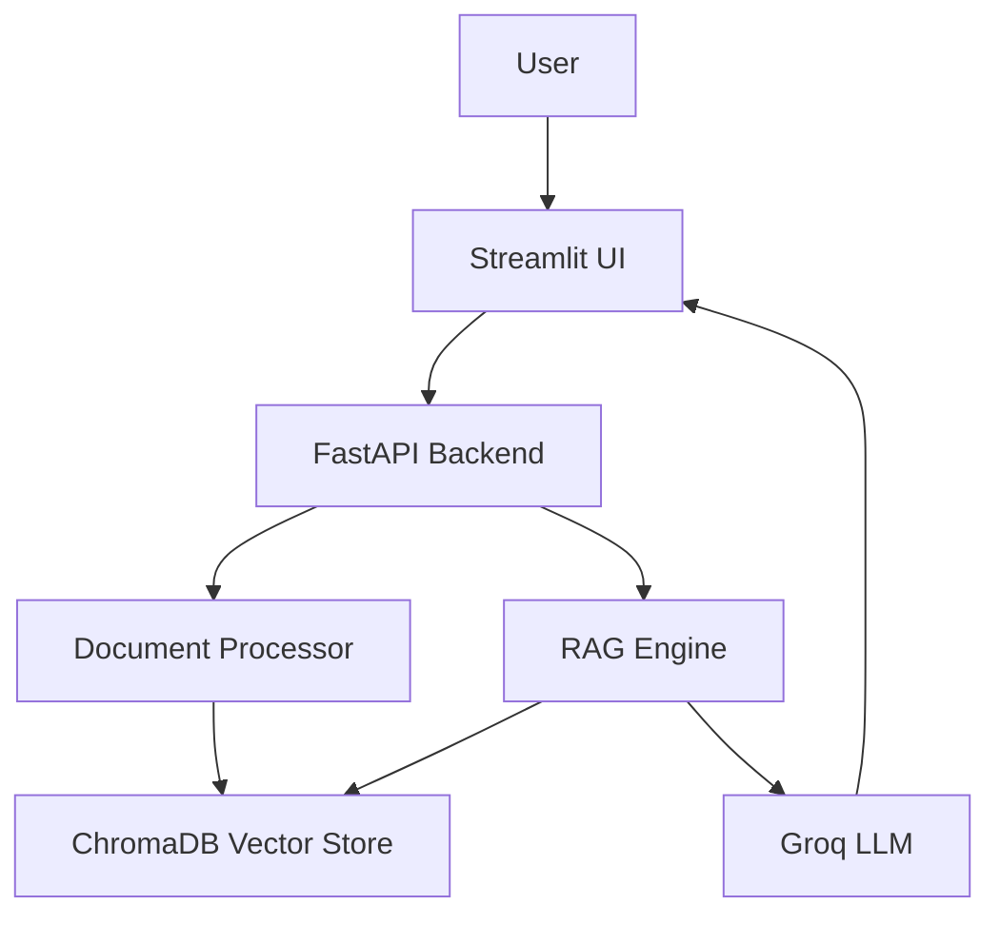

# 📄 Document-Based RAG Chatbot


An intelligent chatbot that answers questions strictly from your uploaded documents using RAG (Retrieval Augmented Generation).

> **Live Demo:** [Deploy on Streamlit Cloud](#deployment)


---

## Features

- Upload PDF and TXT documents
- Intelligent chunking and vector search (ChromaDB + FastEmbed)
- Answers **only** from uploaded documents — no hallucination
- Returns "I don't know" for out-of-scope questions
- Document management: view and delete uploaded docs
- Chat interface with full session message history
- Source attribution in every answer
- Fast inference via Groq API (Llama 3.1 8B)

---

## Tech Stack

| Component | Technology |
|-----------|-----------|
| Backend | FastAPI |
| Frontend | Streamlit |
| Vector Store | ChromaDB |
| LLM | Llama 3.1 8B (via Groq) |
| Embeddings | FastEmbed (BGE-small-en-v1.5) |
| Text Extraction | pdfplumber |

---

## Architecture

```
User → Streamlit UI → FastAPI → Document Processor → ChromaDB
                              → RAG Engine ──────────→ Groq LLM → Response
```



---

## Quick Start

```bash
# Clone
git clone https://github.com/YOUR_USERNAME/rag-document-chatbot.git
cd rag-document-chatbot

# Create virtual environment
python3 -m venv .venv
source .venv/bin/activate  # Windows: .venv\Scripts\activate

# Install dependencies
pip install -r requirements.txt

# Configure
cp .env.example .env
# Edit .env and add your GROQ_API_KEY

# Run
python run.py
```

Open `http://localhost:8501` for the chat UI and `http://localhost:8000/docs` for the API docs.

---

## API Documentation

FastAPI auto-docs available at `http://localhost:8000/docs`.

| Method | Path | Description |
|--------|------|-------------|
| `GET` | `/` | Health check |
| `POST` | `/upload-document` | Upload a PDF or TXT file |
| `POST` | `/query` | Ask a question against uploaded docs |
| `GET` | `/documents` | List all uploaded documents |
| `DELETE` | `/documents/{doc_id}` | Delete a document by ID |

### POST `/upload-document`
**Request:** `multipart/form-data` with `file` field  
**Response:**
```json
{
  "doc_id": "uuid",
  "filename": "example.pdf",
  "num_chunks": 42,
  "message": "Document uploaded successfully"
}
```

### POST `/query`
**Request:**
```json
{ "question": "What are the main findings?" }
```
**Response:**
```json
{
  "answer": "According to example.pdf, the main findings are...",
  "sources": ["example.pdf"],
  "chunks_used": 3
}
```

---

## Project Structure

```
rag-document-chatbot/
├── backend/
│   ├── __init__.py
│   ├── main.py              # FastAPI app — 4 endpoints
│   ├── rag_engine.py        # RAG pipeline (embed, retrieve, generate)
│   ├── document_processor.py# PDF/TXT extraction and chunking
│   └── config.py            # Settings via pydantic-settings
├── frontend/
│   └── app.py               # Streamlit chat + document management UI
├── streamlit_app.py         # Single-file entry point for Streamlit Cloud
├── run.py                   # Local runner (starts backend + frontend)
├── requirements.txt
├── .env.example
├── .gitignore
└── .streamlit/
    └── config.toml
```

---

## How It Works

1. **Upload** → Extract text from PDF/TXT → Split into 500-char chunks → Embed with BGE-small → Store in ChromaDB
2. **Question** → Embed the question using the same model → Search ChromaDB for similar chunks
3. **Retrieve** → Fetch top-5 most similar chunks; reject if similarity score exceeds threshold
4. **Generate** → Feed retrieved chunks as context to Llama 3.1 8B via Groq; LLM answers only from provided context

---

## Deployment

### Streamlit Cloud

1. Push this repo to GitHub
2. Go to [share.streamlit.io](https://share.streamlit.io) and create a new app
3. Set **Main file path** to `streamlit_app.py`
4. Add your secret in **Settings → Secrets**:
   ```toml
   GROQ_API_KEY = "your_groq_api_key_here"
   ```
5. Deploy

The `streamlit_app.py` file starts the FastAPI backend in a background thread automatically — no separate server needed on Streamlit Cloud.

---

## License

MIT
